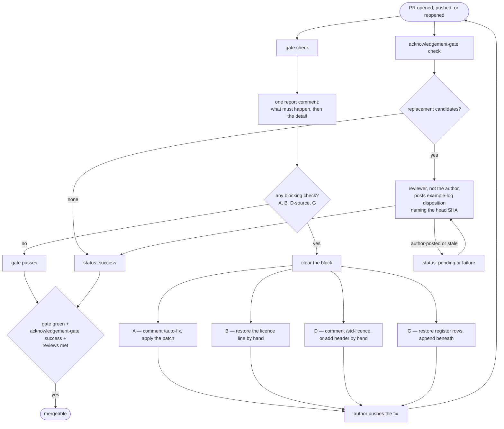

# licence-gate-tooling

Composite actions enforcing licence-compliance rules on pull requests. Consumed by
other repositories, **pinned to a commit SHA**.

Generic by design: nothing here names a real project, licence, or file.

## Why the code lives here and not in the repository being gated

The gate must not be editable by the thing it is gating.

The first version put the checks in each repository's own `scripts/` directory. The
workflow checked out the pull request and ran the gate from that checkout — so a
pull request could edit the gate to report nothing, exit zero, and pass itself. No
permissions and no cleverness required: change the file you are being judged by.

The comment commands had the same shape with worse consequences: they held
`contents: write` at the time, so a script the pull request supplied ran under the
workflow token — an escalation from "can push a branch" to "can act as the workflow".
They no longer hold it at all; see *No bot pushes to a pull request branch* below.

Consumed as a pinned action, the code that runs is fixed at the pin. The pull
request's *content* is read freely; that is the input. Its *code* is never executed.

## Pin to a SHA. Not a tag, not a branch.

```yaml
uses: moodyjmz/licence-gate-tooling/actions/gate@<40-character-sha>   # correct
uses: moodyjmz/licence-gate-tooling/actions/gate@main                 # wrong
uses: moodyjmz/licence-gate-tooling/actions/gate@v1                   # wrong
```

This is load-bearing, not style. Pinned to a SHA, a push here reaches nobody until
someone bumps the pin, and that bump is a reviewed pull request in the consuming
repository — which is why consuming repositories need no special protection, and why
this repository does not need to be locked down harder than they are.

Pinned to a branch or a tag, one push here changes the gate everywhere
simultaneously, with no review anywhere, and this repository becomes the most
security-critical thing in the estate. A tag is not immutable; it can be moved.

## The actions

| Action | Trigger | Permissions | What it does |
|---|---|---|---|
| `actions/gate` | `pull_request` | `contents: read`, `pull-requests: write` | Blocks on removed licence lines, missing modification notices, and new files needing a decision. Lists candidate replacement events. |
| `actions/acknowledgement` | `pull_request`, `issue_comment` | `contents: read`, `pull-requests: read`, `statuses: write` | Requires a reviewer — not the author — to disposition every candidate, against the current head. |
| `actions/auto-fix` | `issue_comment` | `contents: read`, `pull-requests: write` | Works out the modification notice for modified files and posts it as a patch comment. Mechanical; never touches new files. |
| `actions/std-licence` | `issue_comment` | `contents: read`, `pull-requests: write` | Works out headers for new files on an explicit assertion of authorship and posts them as a patch comment. |

### No bot pushes to a pull request branch

`auto-fix` and `std-licence` post a patch as a comment. The author applies it and
pushes it themselves. Neither holds `contents: write`, and neither ever will.

They used to push the change as `github-actions[bot]`, and that quietly defeated the
protection the rest of this design rests on. Branch protection's
`require_last_push_approval` exists so that whoever pushed last cannot be the one who
approves. Put a bot push in between and it is satisfied by the wrong thing: a person
with write access pushes a commit to somebody else's pull request, comments
`/auto-fix`, the bot pushes on top — and that person is now free to approve the
commit they wrote themselves. The record reads "approved by them at that sha", which
is entirely true and worth nothing.

The same push moves the head, so with `dismiss_stale_reviews` on, the tooling
destroyed the approvals it had just collected.

A patch the author applies is an ordinary push by an ordinary contributor, which
every branch-protection rule then judges exactly as designed. There is no flag to
restore the push: an unsafe path that is off by default is still an unsafe path, and
this repository has been bitten three times by a safeguard that carried an exemption.

### The division that the whole design rests on

**Which licence** is a function of the path. Mechanical, decidable, testable.

**Who holds copyright** is a function of who wrote it. Not decidable by any machine,
so it is asserted by a person and only recorded.

Conflating the two produces both of the real-world failures this exists to prevent:
a rule reading "new files get our header" stamps a vendored third-party asset with
your copyright, and a rule reading "our files get our licence" drops a copyleft file
into a permissively-licensed example tree that exists to be copied.

### Refusal is a first-class outcome

Where the licence cannot be determined, the answer is "a person decides" — never a
guess. A wrong header looks settled, so nobody re-examines it.

Candidate detection runs the other way and over-reports on purpose. It may say "this
might be a replacement"; it may never say "this isn't". A false prompt costs a
reviewer seconds. A false all-clear is a missing record nobody knows is missing.

### The acknowledgement gate is decorative until you mark it required

`actions/acknowledgement` always exits 0 as a workflow step. That is on purpose — it
must be able to report `pending` while it waits for a reviewer, and a failed step
cannot say `pending`. Its teeth are the **commit status** it writes, named by the
`status-context` input and defaulting to `acknowledgement-gate`.

**A commit status blocks nothing unless branch protection says it must pass.** If the
consuming repository does not mark that status as a required check, the whole
disposition mechanism is inert: candidates go undispositioned, the status sits on
`pending` or `failure` where nobody is obliged to look, the workflow step is green,
and the pull request page is green. Nothing about the pull request page tells you
this has happened — which is the same false all-clear the gate exists to prevent,
relocated to the repository settings.

So, in every consuming repository: mark the status as a required check. And mark it
under the name the action is *actually configured to write* — if you override
`status-context`, protecting the default `acknowledgement-gate` gives you a required
check that never reports, which blocks every pull request for ever and gets removed
by the first person it inconveniences.

## What happens when a pull request arrives

Two required checks run on every push, in parallel and independent: `gate` reports and
blocks, `acknowledgement-gate` records the reviewer's decisions. Neither pushes to the
branch; the author applies every fix.



1. **Open or push.** `gate` and `acknowledgement-gate` both run against
   `merge-base..head`.
2. **`gate` posts one report comment** — "what has to happen before this merges" first,
   then the detail. It **blocks** on A (missing modification notice), B (a removed or
   altered licence line), D (a new source file with no decision), and G (a register row
   changed); everything else it lists as a **candidate** for a person.
3. **`acknowledgement-gate` writes a commit status** from the candidate list: `success`
   when there is nothing to disposition or every candidate has an eligible disposition,
   `pending` while it waits, `failure` if the author tried to sign off or a disposition
   is stale or incomplete.
4. **Clearing a block:** `/auto-fix` for A (the bot posts a patch, the author applies
   it); restore the line by hand for B; `/std-licence <files>` for D if the files are
   ours, otherwise add the real header by hand; restore the rows and append for G.
5. **Dispositioning a candidate:** a reviewer who is not the author copies the
   `example-log:` block from the report, answers each `path ->` with a register id or
   `not a replacement`, and posts it. The status re-runs and turns green.
6. **Every push re-runs both checks and lapses dispositions** — a new head SHA is a new
   tree, and a disposition names the SHA it was made against, so a sign-off never
   silently carries over to code nobody signed for.
7. **Merge** once `gate` is green, the `acknowledgement-gate` status is `success`, and
   the repository's own review rules are met. Branch protection makes the two checks
   binding, and `enforce_admins` applies them to everyone, the owner included.

There is deliberately no way to clear a block invisibly. An attributed override — a
recorded, reviewer-signed clearance for A, B or D, never G — is designed but not yet
built; see [`docs/override-design.md`](docs/override-design.md).

## Consuming it

See [`examples/`](examples/) for the four caller workflows. They are thin: trigger,
permissions, checkout, and the pinned `uses:`. Everything else is here.

## Tests

```sh
cd scripts && python3 -m unittest discover -p 'test_*.py'
```

**Python 3.9 or newer**, with no third-party packages beyond PyYAML for the tests.
3.9 is not nostalgia: it is what a contributor's system Python is likely to be, and
holding it is why the two places that would otherwise use `tomllib` (3.11) parse what
little TOML they need themselves. CI runs the suite at both ends of that range, so a
construct newer than the floor fails here rather than on somebody's laptop. Running
the action definitions needs node.

`test_licence_map` covers the pure decisions. `test_gate_integration` drives the gate
against real throwaway git repositories, because every defect found in the security
audits lived in the git-interacting code and none were reachable from a pure-function
test. `test_gate_action` and `test_patch_only_actions` extract the `run:` bodies out
of the action definitions and execute them, because the controls written in YAML are
the ones a pull request reaches first and nothing used to run them at all.

Each test names the real failure it guards against — a test whose purpose is not
obvious gets deleted in six months by someone who cannot see why it matters.
